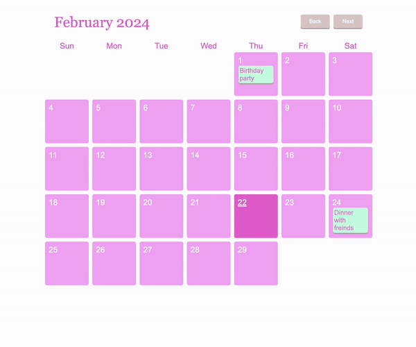

# 🗓️ calendar

- add / edit / delete event



### Next Challenge

- responsive web design flexbox or mobile version
- dark / light mode

## 💻 Features

### Calendar Display 📆

a monthly calendar with navigating between months

### Event Management 📝

add, edit, and delete events for specific dates

### Modal Dialogs 💬

for adding new events and editing existing ones

### Local Storage 💾

store events locally using browser's local storage for persistence

## ✅ What I Learned

### setTimeout() method

calls a function after a number of milliseconds

```
setTimeout(() => {
    const titles = document.querySelectorAll(".title");

    titles.forEach((title) => {
        // \s : whitespace (regex)
      if (!/\s/.test(title.innerText)) {
        title.classList.add("break-all");
      }
    });
}, 0); //set the time to 0 so that it will run between the next event loop

```

<hr>

### flex-wrap

specifies whether the flexible items should wrap or not<br>
If the elements are not flexible items, the flex-wrap property has no effect

```
#calendar {
  /* Arranged in multiple rows, not in a single row */
  display: flex;
  flex-wrap: wrap;
}
```

### word wrap

```
/* Set text to wrap when it goes over a div */
overflow-wrap: break-word;
word-wrap: break-word;

/* wrap on a word-by-word basis */
word-break: break-all;
```

### the drop-shadow() filter function

creates a shadow that conforms to the image’s shape <br>
(vs box-shadow property creates a rectangular shadow)

```
#save {
  /* Horizontal, Vertical, blur */
  filter: drop-shadow(0px 3px 0px rgb(187, 173, 173));
}
```

<hr>

### getMonth()

method of a Date object returns the month starting at 0

```
const firstDayOfMonth = new Date(year, month, 1);
// day 1 is the first day of the current month

const daysInMonth = new Date(year, month + 1, 0).getDate();
// jump to the next month, and ask for day 0 to get the last day of the current month
```

### Date.toLocaleDateString()

Returns a date as a string value appropriate to the host environment's current locale

```
const dateString = firstDayOfMonth.toLocaleDateString("en-US", {
    weekday: "long",
    year: "numeric",
    month: "numeric",
    day: "numeric",
  });
```

toLocaleString('en-US', options) means to display the options in English

numeric property is used to localize dates, numbers, and currencies, and its value is either true or false.

### Array find()

find() method of Array instances returns the first element in the provided array that satisfies the provided testing function. If no values satisfy the testing function, undefined is returned

```
const eventForDay = events.find(e => e.date === clicked);
```

### Array filter()

creates a new array filled with elements that pass a test provided by a function<br>
does not change the original array

```
events = events.filter((e) => e.date !== clickedDate);
```

### Array findIndex()

returns the index (position) of the first element that passes a test<br>
returns -1 if no match is found<br>
does not change the original array

```
const eventIndex = events.findIndex((e) => e.date === clickedDate);
events[eventIndex].task = editInputField.value;
```

## 🛠️ Troubleshooting

### class not being added

Cause: titles.forEach loop is inside the load() function, t is not executed every time a new calendar is loaded

Solution: isolate the titles.forEach loop, which is located inside the load() function, and ensure that it runs after the load function has completed

```
function load(){

...

  setTimeout(() => {
    const titles = document.querySelectorAll(".title");

    titles.forEach((title) => {
      if (!/\s/.test(title.innerText)) {
        title.classList.add("break-all");
      }
    });
  }, 0);
}
```

### Uncaught TypeError: Cannot read properties of undefined (reading 'task')

Cause: Only when 'eventForDay' is defined, the 'task' property can be read and its value assigned to 'eventTitle'

Solution:

```
if (eventForDay) { // This will prevent an error from occurring even if 'eventForDay' is undefined
  eventTitle.innerText = eventForDay.task;
}
```
