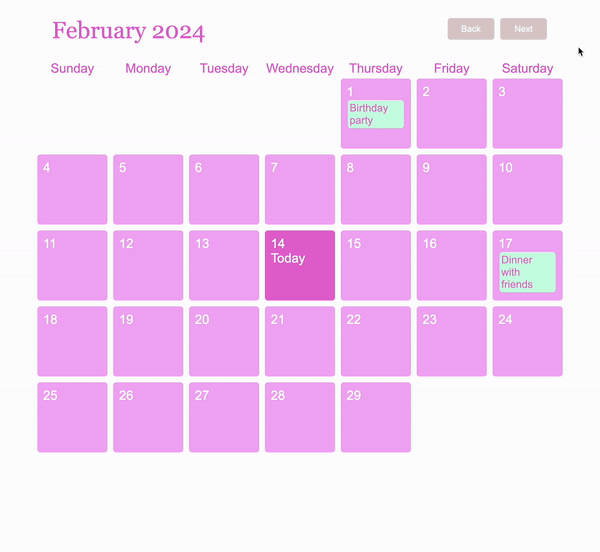
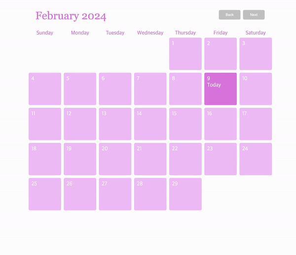

# 🗓️ calendar

- add / edit / delete event



<details>
<summary>ver1</summary>
<div markdown="1">



</div>
</details>

### Next Challenge

- responsive web design
- handle whitespace

## 💻 Process

- open modal

```
editModal.style.display = "block";
newModal.style.display = "block";
```

- save event

```
events.push({
    date: clickedDate,
    task: newInputField.value,
});
```

- edit event

```
const eventIndex = events.findIndex((e) => e.date === clickedDate);
events[eventIndex].task = editInputField.value;
```

- delete event

```
events = events.filter((e) => e.date !== clickedDate);
```

- close modal

```
newModal.style.display = "none";
editModal.style.display = "none";
```

## ✅ What I Learned

### flex-wrap

specifies whether the flexible items should wrap or not<br>
If the elements are not flexible items, the flex-wrap property has no effect

```
#calendar {
  /* Arranged in multiple rows, not in a single row */
  display: flex;
  flex-wrap: wrap;
}
```

<hr>

### getMonth()

method of a Date object returns the month starting at 0

```
const firstDayOfMonth = new Date(year, month, 1);
// day 1 is the first day of the current month

const daysInMonth = new Date(year, month + 1, 0).getDate();
// jump to the next month, and ask for day 0 to get the last day of the current month
```

### Date.toLocaleDateString()

Returns a date as a string value appropriate to the host environment's current locale

```
const dateString = firstDayOfMonth.toLocaleDateString("en-US", {
    weekday: "long",
    year: "numeric",
    month: "numeric",
    day: "numeric",
  });
```

toLocaleString('en-US', options) means to display the options in English

numeric property is used to localize dates, numbers, and currencies, and its value is either true or false.

### Array find()

find() method of Array instances returns the first element in the provided array that satisfies the provided testing function. If no values satisfy the testing function, undefined is returned

```
const eventForDay = events.find(e => e.date === clicked);
```

### Array filter()

creates a new array filled with elements that pass a test provided by a function<br>
does not change the original array

```
events = events.filter((e) => e.date !== clickedDate);
```

### Array findIndex()

returns the index (position) of the first element that passes a test<br>
returns -1 if no match is found<br>
does not change the original array

```
const eventIndex = events.findIndex((e) => e.date === clickedDate);
events[eventIndex].task = editInputField.value;
```

## 🛠️ Troubleshooting

### Uncaught TypeError: Cannot read properties of undefined (reading 'task')

Cause: Only when 'eventForDay' is defined, the 'task' property can be read and its value assigned to 'eventTitle'

Solution:

```
if (eventForDay) { // This will prevent an error from occurring even if 'eventForDay' is undefined
  eventTitle.innerText = eventForDay.task;
}
```
